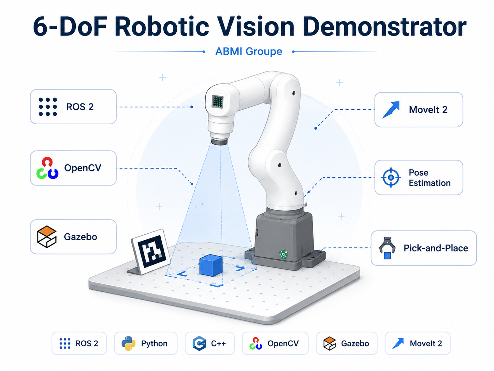
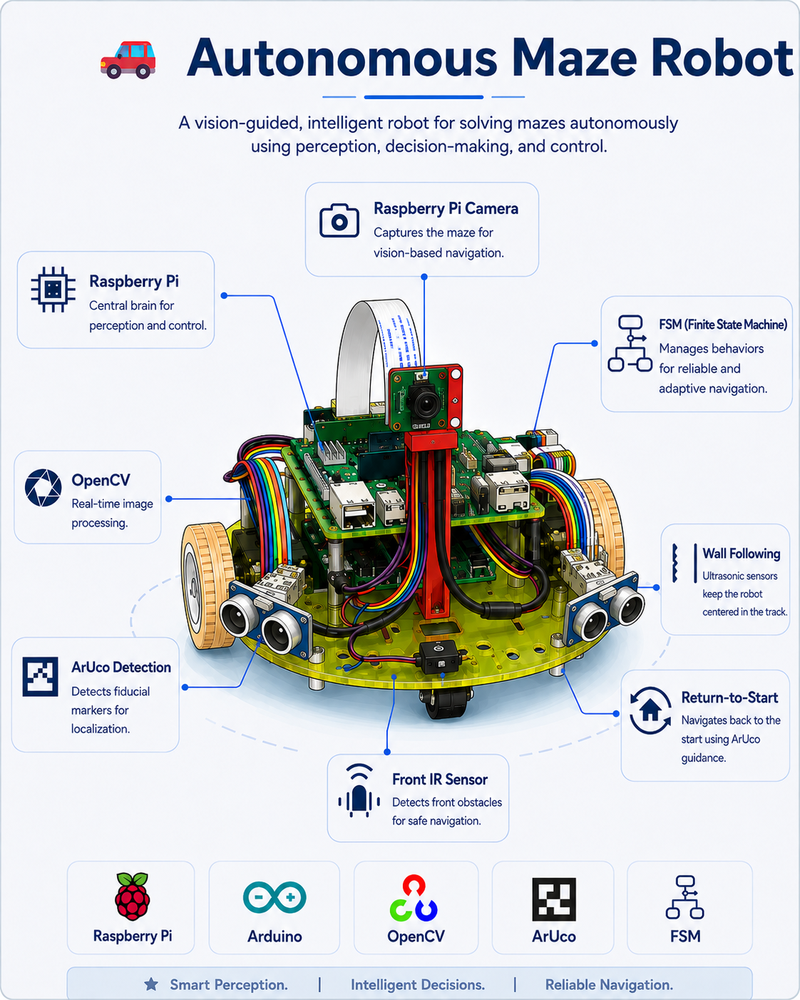
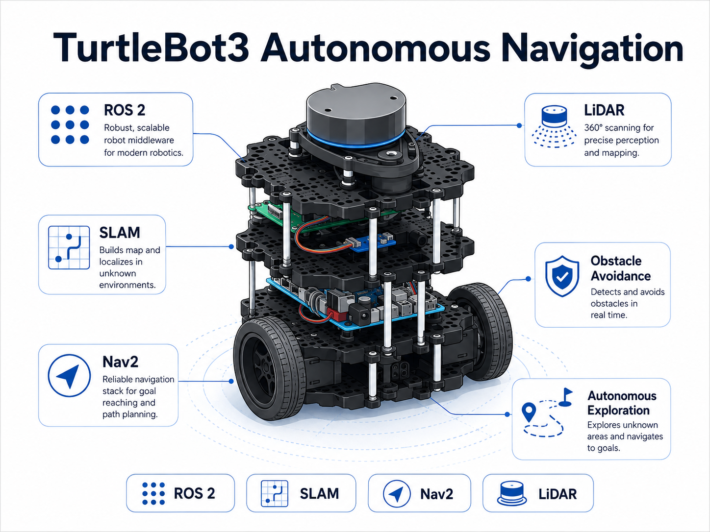
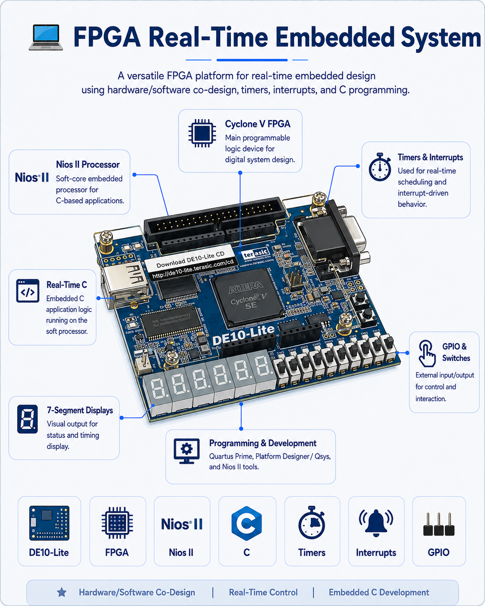
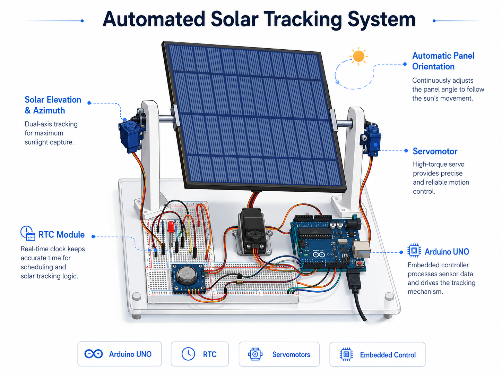

 

---

## 👋 About Me

I’m **Osama Bashoaib**, a Master 2 student in **Mechatronics, Energy and Intelligent Systems (MESI)** at the University of Strasbourg, currently completing my **final-year internship in Robotics & Computer Vision at ABMI Groupe**.

I develop and integrate robotic systems that connect **perception, autonomous navigation, control, simulation and embedded software** — from sensor data to validated behavior on a physical robot.

### `Sensors → Perception → Localization → Planning → Control → Real Robot`

### 🔎 Engineering Snapshot

* **Robotics:** ROS 2, MoveIt 2, Nav2, Gazebo Harmonic, URDF
* **Perception:** OpenCV, DREAM, ArUco / ChArUco, camera calibration, filtering, 6-DoF pose estimation
* **Autonomous systems:** LiDAR, SLAM, occupancy grids, odometry, Dijkstra, obstacle avoidance
* **Embedded software:** Raspberry Pi, Arduino, FPGA, UART, I²C, PWM, GPIO, timers and interrupts
* **Development:** C, C++, Python, Linux, Git, TCP/IP
* **Validation:** simulation, physical-robot testing, accuracy and robustness analysis, technical documentation

---

## 🤖 Current Engineering Focus

### 6-DoF Vision-Guided Robotic Arm — ABMI Groupe

  

`ROS 2` `Python` `C++` `Linux` `OpenCV` `DREAM` `Gazebo Harmonic` `MoveIt 2` `TCP`

Development and integration of a **vision-guided MyCobot 320 Pi demonstrator** for robotic manipulation and pick-and-place.

My publicly shareable work includes:

* **Closed-loop visual servoing** for robot guidance and pick-and-place
* ROS 2 integration using **Galactic / Jazzy**, MoveIt 2 and TCP communication under Linux
* Image acquisition and a vision pipeline using **OpenCV / DREAM**
* **Camera calibration**, filtering and **6-DoF pose estimation**
* ArUco / ChArUco-based perception and tracking
* Robot modelling and simulation with **Gazebo Harmonic**
* Experimental validation in simulation and on the **physical robot**
* Accuracy, robustness and technical-validation analysis

### [Project overview →](projects/abmi-robotic-vision.md)

### [Public ABMI repository / pick-and-place branch →](https://github.com/ABMI-software/mycobot_320pi_R6A/tree/feature/pick-and-place-osama)

> Only publicly shareable information about the ABMI project is presented here.

---

## 🌟 Featured Engineering Projects

<table>

<tr>

<td width="50%" valign="top">

### 🚗 [Autonomous Mobile Robot — York](projects/autonomous-maze-robot.md)

 

`C++` `Python` `Linux` `Raspberry Pi` `Arduino` `OpenCV` `ArUco`

Autonomous mobile-robot architecture combining **PWM motor control, encoders, odometry, PI regulation, FSM, Dijkstra planning on an occupancy grid, perception and low-pass filtering**.

Hardware/software integration between a **Raspberry Pi 4 and Arduino Nano 33 BLE**, using UART and I²C for communication and sensor acquisition.

**[Explore project →](projects/autonomous-maze-robot.md)**

</td>

<td width="50%" valign="top">

### 🗺️ [TurtleBot3 Autonomous Navigation](projects/turtlebot3-autonomous-navigation.md)

 

`ROS 2 Humble` `SLAM` `Nav2` `LiDAR` `Explore Lite`

TurtleBot3 integration under Ubuntu 22.04 with **Raspberry Pi 4, OpenCR and LDS-01 LiDAR**.

Implementation of **SLAM, autonomous exploration, path planning and obstacle avoidance** in simulation and on the physical robot.

**[Explore project →](projects/turtlebot3-autonomous-navigation.md)**

</td>

</tr>

<tr>

<td width="50%" valign="top">

### 💻 [FPGA Real-Time Embedded System](projects/fpga-real-time-system.md)

 

`DE10-Lite` `Nios II` `C` `Avalon` `Timers` `Interrupts`

Hardware/software design of a real-time embedded system on **DE10-Lite FPGA**, integrating a Nios II processor, On-Chip memory and PIO/GPIO peripherals.

Development in **C** with timers, interrupts and JTAG UART debugging.

**[Explore project →](projects/fpga-real-time-system.md)**

</td>

<td width="50%" valign="top">

### ☀️ [Automated Solar Tracking System](projects/automated-solar-tracking-system.md)

 

`C++` `Arduino UNO` `RTC` `Servomotors` `Autodesk Inventor`

Embedded mechatronics system for automatic photovoltaic-panel orientation, combining **C++ control, servomotors, RTC timing and mechanical design**.

**[Explore project →](projects/automated-solar-tracking-system.md)**

</td>

</tr>

</table>

---

## 🚀 What I Work On

* **Robot perception** — camera calibration, image processing, tracking and 6-DoF pose estimation
* **Autonomous navigation** — SLAM, LiDAR, Nav2, occupancy grids, planning and obstacle avoidance
* **Robot manipulation** — MoveIt 2, vision-guided control and pick-and-place
* **Embedded robotics** — Raspberry Pi, Arduino, sensor acquisition and actuator control
* **Real-time embedded systems** — FPGA, Nios II, timers, interrupts and hardware/software integration
* **Simulation-to-real validation** — Gazebo-based development followed by testing on physical robotic systems

---

## 🛠 Core Technologies

  

---

## 🧩 Technology Matrix

| Area                             | Tools & Technologies                                                                          |
| -------------------------------- | --------------------------------------------------------------------------------------------- |
| 🤖 **Robotics**                  | ROS 2, MoveIt 2, Gazebo Harmonic, RViz, Nav2, SLAM, URDF                                      |
| 👁️ **Computer Vision**          | OpenCV, DREAM, ArUco, ChArUco, solvePnP, camera calibration, filtering, 6-DoF pose estimation |
| 🗺️ **Autonomous Navigation**    | LiDAR, occupancy grids, odometry, Dijkstra, Explore Lite, path planning, obstacle avoidance   |
| 💻 **Programming**               | Python, C, C++, Bash                                                                          |
| 🔧 **Embedded Systems**          | Raspberry Pi, Arduino, FPGA, UART, I²C, PWM, GPIO                                             |
| ⚡ **Real-Time Systems**          | Nios II, timers, interrupts, Avalon, hardware/software integration                            |
| 🧪 **Simulation & Modelling**    | Gazebo Harmonic, MATLAB / Simulink, URDF                                                      |
| 🐧 **Development & Integration** | Linux, Git, GitHub, TCP/IP, JTAG UART                                                         |

---

## 🎯 Current Focus

`Robot Perception` · `Computer Vision` · `Autonomous Robotics`

`LiDAR & SLAM` · `Vision-Guided Manipulation` · `Embedded Linux`

`Sensor Integration` · `Simulation-to-Real` · `Hardware/Software Integration`

---

## 💼 Career Interests

I’m interested in engineering opportunities involving:

* **Robotics / Mechatronics Engineering**
* **Perception & Computer Vision**
* **Autonomous Mobile Robotics**
* **Embedded Robotics Software**
* **Sensor Integration, Localization & Navigation**

**Available for a full-time position from 22 October 2026.**

---

## 🤝 Connect

    

    

 

### Open to opportunities in

**Robotics • Mechatronics • Computer Vision • Autonomous Systems • Embedded Software**

---

